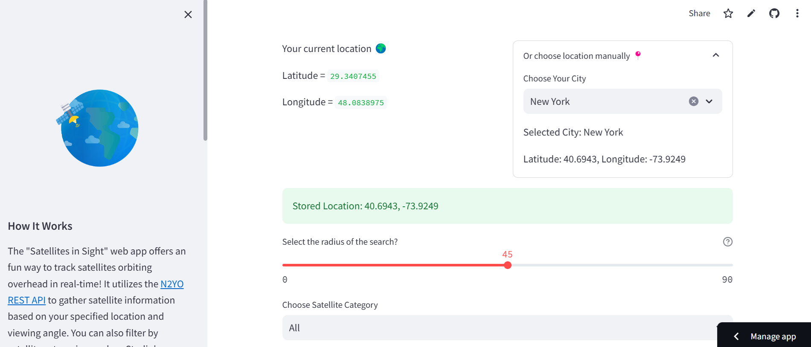
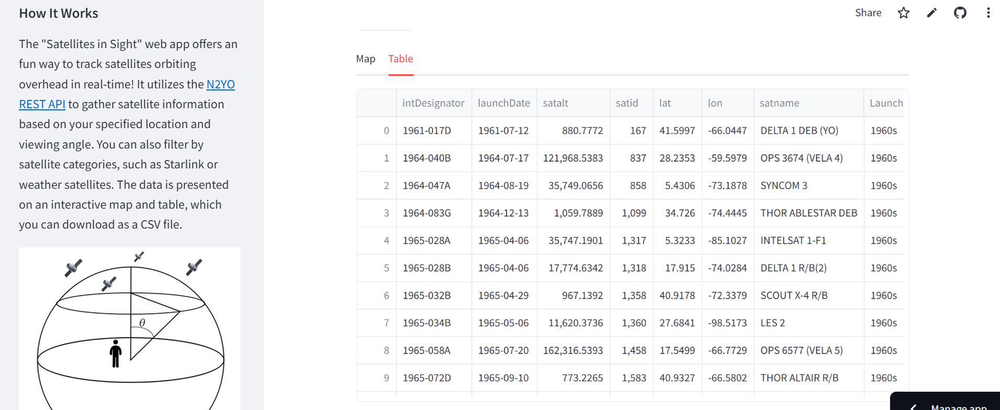

# Satellites in Sight: Real-Time Satellite Tracker 🌍🛰️

The **Satellites in Sight** web app allows you to track satellites in real time based on your current or selected location. This app uses the N2YO API to fetch satellite data, and presents it visually through an interactive map and detailed table. You can filter satellites by category (e.g., Starlink, GPS, Weather) and adjust the search radius to explore the sky above you.

[View the app]("https://satellites-in-sight.streamlit.app/")

## Features

- **Real-time satellite tracking**: See which satellites are passing over your location.
- **Interactive map**: Visualize satellite positions on an interactive map using Plotly.
- **Satellite categorization**: Filter satellites by category, including Starlink, GPS, NOAA, and more.
- **Search radius control**: Set the search radius from 0° (directly above) to 90° (full sky).
- **Downloadable satellite data**: Export the satellite data in a CSV format for further analysis.

## Screenshots

## How It Works

1. **Location-based tracking**: The app first fetches your current geolocation. Alternatively, you can choose a city manually from a list of worldwide cities.
2. **Search parameters**: You can adjust the search radius (0° to 90°) and select the satellite category you want to explore.
3. **Satellite data**: Based on the inputs, the app queries the N2YO API to fetch real-time satellite information.
4. **Visualization**: Satellites are shown on a map, color-coded by their launch decade for better understanding.
5. **Table of satellite information**: A detailed table showing information like satellite name, launch date, altitude, and satellite ID.

## Resources

- [N2YO API Documentation](https://www.n2yo.com/api/#above): This is the source for the satellite data used in the app.
- [Open Elevation API](https://open-elevation.com/): Used to fetch the elevation of the given coordinates for accurate satellite data retrieval.

## License

This project is licensed under the MIT License - see the [LICENSE](LICENSE) file for details.
